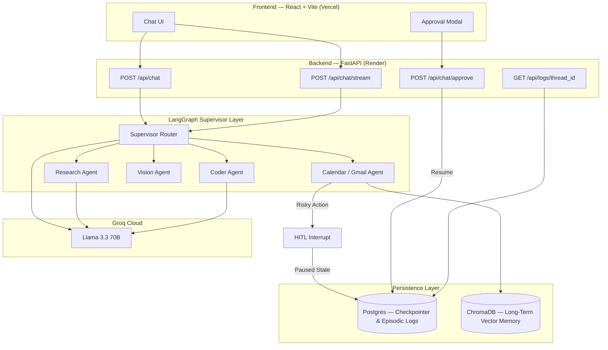
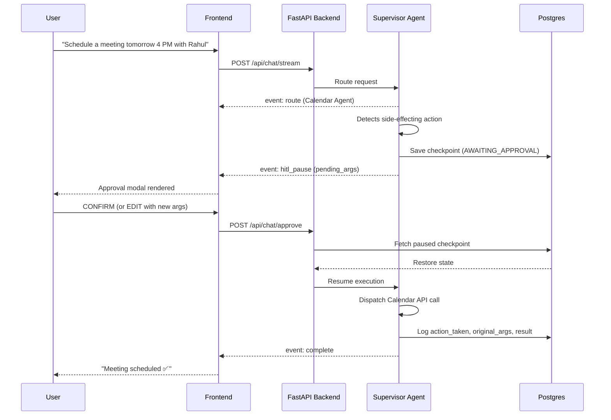

<div align="center">

# AgentOS Core 🤖

### Enterprise-Grade Multi-Agent Orchestration Platform

**A LangGraph-powered autonomous agent system with Supervisor routing, Human-in-the-Loop safety, persistent state, and real-time tool execution.**

<br/>

[](https://agentos-core-ssl7.onrender.com)
[](https://agentos-core-ivory.vercel.app)
[](https://www.python.org/)
[](https://fastapi.tiangolo.com/)
[](https://www.langchain.com/langgraph)
[](https://groq.com/)
[](https://neon.tech/)

[**Live Demo**](https://agentos-core-ivory.vercel.app) ·
[**API Docs (Swagger)**](https://agentos-core-ssl7.onrender.com/docs) ·
[**Report Bug**](https://github.com/Harsh28-raj/agentos-core/issues) ·
[**Request Feature**](https://github.com/Harsh28-raj/agentos-core/issues)

</div>

---

## Table of Contents

- [Overview](#overview)
- [Why Multi-Agent, Not a Single Chatbot?](#why-multi-agent-not-a-single-chatbot)
- [Key Features](#key-features)
- [System Architecture](#system-architecture)
- [Human-in-the-Loop Workflow](#human-in-the-loop-workflow)
- [Tech Stack](#tech-stack)
- [Project Structure](#project-structure)
- [Local Setup](#local-setup)
- [Environment Variables](#environment-variables)
- [API Overview](#api-overview)
- [Security](#security)
- [Known Limitations](#known-limitations)
- [Roadmap](#roadmap)
- [Author](#author)

---

## Overview

**AgentOS Core** is a Personal AI Operating System — an autonomous backend built on **LangGraph's** stateful graph model, where a **Supervisor Agent** reasons over incoming requests and routes them to specialized sub-agents (Research, Coder, Vision, Calendar, Gmail) rather than handling everything in one monolithic prompt.

Unlike a typical chatbot wrapper, AgentOS Core **remembers across sessions, executes real-world actions, pauses for human approval before anything risky, and logs a full audit trail of every decision it makes.**

> [!TIP]
> Every "risky" action — sending an email, creating a calendar event — goes through an explicit human approval gate before it touches a real API. Nothing happens silently.

---

## Why Multi-Agent, Not a Single Chatbot?

Given a request like *"Check if I'm free tomorrow at 4 PM, and if so, email Rahul the invite,"* the Supervisor Agent:

1. Classifies intent and routes to the **Calendar Sub-Agent**
2. Detects that `create_calendar_event` is a side-effecting action and **pauses execution**, persisting full graph state to Postgres
3. Streams a `hitl_pause` event to the frontend with the pending tool call and arguments
4. Waits — for 5 seconds or 5 hours, it doesn't matter, state is durable
5. On human `CONFIRM` (or edited args via `EDIT`), resumes exactly where it left off and dispatches the real Gmail/Calendar API call
6. Logs the full decision trail — original args, human decision, final result — to the audit table

This **Reason → Route → Pause → Resume** loop is what separates an agentic system from a chatbot with API access.

---

## Key Features

<table>
<tr>
<td width="50%" valign="top">

#### Multi-Agent Orchestration
- Supervisor Router with dynamic sub-agent handoff
- Specialized agents: Research, Coder, Vision, Calendar, Gmail
- Loop-prevention guardrail (max iteration cap)
- Token & cost tracking per LLM call

#### Real-Time Streaming
- Server-Sent Events at `/api/chat/stream`
- Live status events: `thinking`, `route`, `tool_start`, `tool_end`, `token`, `hitl_pause`, `complete`
- Frontend renders live "Routing to Coder Agent..." status, not a blank spinner

</td>
<td width="50%" valign="top">

#### Human-in-the-Loop Safety
- Every side-effecting action pauses for approval
- Three resolutions: `CONFIRM`, `REJECT`, or `EDIT` (override tool arguments before execution)
- State persisted in Postgres — survives restarts, no timeout on pending approvals

#### Memory & Auditability
- Short-term thread memory via LangGraph's Postgres checkpointer
- Long-term semantic memory via ChromaDB (RAG over uploaded PDFs & images)
- Full episodic audit log — every tool call, latency, and human decision, queryable per thread

</td>
</tr>
</table>

#### Tool Suite
- 🌐 **Web Search** — Tavily API for live facts and news
- 🌦️ **Weather** — real-time conditions
- 🐍 **Code Interpreter** — sandboxed Python execution for math, data, and logic
- 👁️ **Vision** — Groq vision model for image/diagram/receipt analysis, auto-synced to memory
- 📄 **Document RAG** — PDF upload, parsed and embedded into ChromaDB
- 📧 **Gmail Agent** — search, read, draft, and send email (draft-first, approval-gated)
- 📅 **Calendar Agent** — create events from natural language, HITL-approved

---

## System Architecture



---

## Human-in-the-Loop Workflow



---

## Tech Stack

| Layer | Technology |
|---|---|
| Backend Framework | FastAPI (async), Python 3.11+ |
| Agent Orchestration | LangGraph (Supervisor pattern), LangChain Core |
| LLM Inference | Groq Cloud — Llama 3.3 70B Versatile |
| State & Checkpointing | PostgreSQL (Neon) via `AsyncPostgresSaver` |
| Long-Term Memory | ChromaDB (vector store) |
| External Integrations | Gmail API, Google Calendar API, Tavily Search |
| Frontend | React.js, Vite, TailwindCSS |
| Deployment | Render (backend), Vercel (frontend) |

---

## Project Structure

agentos-core/
├── app/
│ ├── ai/
│ │ ├── agents/
│ │ │ ├── supervisor.py # Central routing controller
│ │ │ ├── research_agent.py
│ │ │ ├── coder_agent.py
│ │ │ └── vision_agent.py
│ │ ├── tools/
│ │ │ ├── gmail.py # search / read / draft / send
│ │ │ ├── calendar_tools.py
│ │ │ └── code_interpreter.py
│ │ └── agent.py # Graph definition & tool binding
│ ├── db/
│ │ ├── chroma_db/
│ │ └── vector_store.py
│ └── main.py # Routes, SSE generators, approval endpoint
├── frontend/ # React + Vite SPA
├── requirements.txt
└── README.md


---

## Local Setup

### Prerequisites
- Python 3.11+
- Node.js 18+
- A PostgreSQL database (Neon or self-hosted)

### Backend

```bash
git clone https://github.com/Harsh28-raj/agentos-core.git
cd agentos-core

python -m venv venv
source venv/bin/activate      # Windows: venv\Scripts\activate
pip install -r requirements.txt

cp .env.example .env
# Add GROQ_API_KEY, TAVILY_API_KEY, DATABASE_URL, GOOGLE_CLIENT_ID, GOOGLE_CLIENT_SECRET

uvicorn app.main:app --reload --port 10000
```

### Frontend

```bash
cd frontend
npm install
npm run dev
```

| Service | URL |
|---|---|
| Backend (Swagger UI) | http://localhost:10000/docs |
| Frontend | http://localhost:5173 |

---

## Environment Variables

| Variable | Required | Description |
|---|:---:|---|
| `GROQ_API_KEY` | ✅ | Groq inference API key |
| `TAVILY_API_KEY` | ✅ | Live web search |
| `DATABASE_URL` | ✅ | Postgres connection string (checkpointer + logs) |
| `GOOGLE_CLIENT_ID` / `GOOGLE_CLIENT_SECRET` | ✅ | Gmail & Calendar OAuth |
| `GMAIL_TOKEN` | ✅ | Generated via `generate_token.py` |

> [!WARNING]
> Never commit `.env`, `credentials.json`, or `token.json` — all three are covered by `.gitignore`.

---

## API Overview

| Method | Endpoint | Description |
|---|---|---|
| `GET` | `/` | Health check |
| `POST` | `/api/chat` | Synchronous agent chat |
| `POST` | `/api/chat/stream` | Real-time SSE streaming (thinking/route/tool events) |
| `POST` | `/api/chat/approve` | Resume a paused execution — `CONFIRM`, `REJECT`, or `EDIT` |
| `POST` | `/api/upload` | Upload PDF or image — parsed and embedded into memory |
| `GET` | `/api/logs/{thread_id}` | Full episodic audit trail for a session |

Full interactive docs: **[agentos-core-ssl7.onrender.com/docs](https://agentos-core-ssl7.onrender.com/docs)**

---

## Security

- All API keys and OAuth secrets loaded via environment variables only
- Draft-first policy on all outbound email — `send_email` never fires without explicit chat confirmation
- Ambiguous confirmations (e.g., "maybe", "let me think") are rejected by the agent; only explicit phrases trigger dispatch
- `.gitignore` excludes all credentials, tokens, and `.env` files from version control

---

## Known Limitations

- **Single-tenant Google OAuth.** Gmail and Calendar currently run on one authenticated account rather than per-user tokens — multi-tenant support is on the roadmap.
- **ChromaDB is local, not yet cloud-persisted.** Long-term vector memory can be lost on a full redeploy since it isn't yet backed by a managed vector store.
- **Calendar tool covers event creation only.** A "check availability / find free slots" tool is not yet implemented.
- **Render free-tier cold starts.** First request after inactivity can take 30–40 seconds.

---

## Roadmap

- [ ] Migrate ChromaDB to a managed Postgres vector store (`pgvector`) for persistent long-term memory
- [ ] Multi-tenant OAuth — per-user encrypted Gmail/Calendar tokens
- [ ] Calendar "Check Availability" tool
- [ ] Cross-agent tool chaining (e.g., check calendar → send Gmail invite in one flow)
- [ ] Voice interface (Whisper API)
- [ ] Local LLM fallback (Ollama) for privacy-sensitive sessions

---

## Author

<div align="center">

**Harsh Raj**

[](https://github.com/Harsh28-raj)
[](https://linkedin.com/in/harsh-raj4308g)

If you find this project useful, consider giving it a star ⭐

</div>
